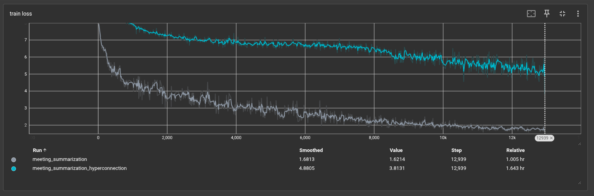

# Transformer from Scratch

A complete implementation of the Transformer architecture from scratch using PyTorch, based on the paper ["Attention is All You Need"](https://arxiv.org/abs/1706.03762) by Vaswani et al.

## Overview

This project implements a full-featured Transformer model for sequence-to-sequence tasks, specifically trained for meeting summarization using the MeetingBank dataset.

## Architecture

The implementation follows the original Transformer architecture with the following components:

### Core Components

- **Multi-Head Attention**: Self-attention mechanism with 8 attention heads
- **Encoder-Decoder Structure**: 6 layers each for encoder and decoder
- **Feed-Forward Networks**: Position-wise feed-forward layers (d_model=512, d_ff=2048)
- **Positional Encoding**: Sinusoidal positional embeddings
- **Input Embeddings**: Learned token embeddings for source and target sequences
- **Layer Normalization**: Applied throughout the network
- **Residual Connections**: Standard skip connections for stable training

### Model Parameters

- **d_model**: 512 (model dimension)
- **d_ff**: 2048 (feed-forward dimension)
- **h**: 8 (number of attention heads)
- **n_layers**: 6 (encoder/decoder layers)
- **dropout**: 0.1
- **vocab_size**: 32,000 tokens
- **max_src_len**: 512 tokens
- **max_tgt_len**: 256 tokens

## HyperConnections Enhancement

In addition to the standard architecture, this implementation includes an experimental **HyperConnections** variant based on the research paper ["HyperConnections"](https://arxiv.org/pdf/2409.19606) (Appendix J, Algorithm 2).

### What are HyperConnections?

HyperConnections replace standard residual connections with a more sophisticated mechanism that:

1. **Maintains a Hyper Hidden Matrix**: Instead of a single hidden state, maintains `(batch, seq, n, dim)` where `n` is the number of parallel streams
2. **Width Mixing**: Combines information across multiple parallel streams using learned attention weights
3. **Depth Connection**: Aggregates information from previous layers with dynamic weighting
4. **Dynamic Modulation**: Adapts connection weights based on the current hidden state

### Key Features

- **Static and Dynamic Weights**: Combines fixed architectural priors with learned dynamic adjustments
- **Multi-Stream Processing**: Maintains `n=4` parallel streams for richer information flow
- **Layer-wise Adaptation**: Each layer can learn different mixing strategies

### Configuration

Toggle between standard residual connections and hyperconnections in `config.py`:

```python
"use_hyper_connection": True,  # Enable HyperConnections
"hyper_n": 4,  # Number of parallel streams
```

## Training Results

The model was trained for 20 epochs on the MeetingBank dataset for meeting summarization:

### Training Comparison

| Model Variant | Final Loss (Smoothed) | Final Loss (Value) | Training Time |
|---------------|----------------------|-------------------|---------------|
| Standard (Residual) | 1.6813 | 1.6214 | 1.005 hr |
| HyperConnections | 4.8805 | 3.8131 | 1.643 hr |

### Loss Curves



The graph shows training loss curves for both variants:
- **Gray line**: Standard transformer with residual connections - shows faster convergence and lower final loss
- **Cyan line**: Transformer with hyperconnections - more stable training dynamics, with potential performance gains after tuning the added hyperparameters over additional epochs.

## Project Structure

```
├── transformer_model.py          # Main transformer architecture
├── config.py                     # Configuration parameters
├── train.py                      # Training script
├── test.py                       # Inference/testing script
├── dataset.py                    # Dataset loading and preprocessing
├── multi_head_attention_components/
│   ├── encoder_block.py         # Encoder implementation
│   ├── decoder_block.py         # Decoder implementation
│   └── multihead_attention.py   # Multi-head attention
├── utils/
│   ├── feed_forward.py          # Feed-forward network
│   ├── hyper_connection.py      # HyperConnection implementation
│   ├── residual_connection.py   # Standard residual connection
│   ├── input_embedding.py       # Token embeddings
│   ├── positional_encoding.py   # Positional encodings
│   ├── layer_normalization.py   # Layer normalization
│   └── projection_layer.py      # Output projection
├── weights/                      # Saved model checkpoints
└── tokenizers/                   # Tokenizer files
```

## Usage

### Training

```bash
python train.py
```

Configure training parameters in `config.py`.

## Dataset

This implementation uses the [MeetingBank dataset](https://huggingface.co/datasets/huuuyeah/meetingbank) for meeting summarization:
- **Task**: Summarize meeting transcripts
- **Source**: Meeting transcripts (up to 512 tokens)
- **Target**: Meeting summaries (up to 256 tokens)

## References

1. Vaswani, A., et al. (2017). ["Attention is All You Need"](https://arxiv.org/abs/1706.03762)
2. HyperConnections Paper: [https://arxiv.org/pdf/2409.19606](https://arxiv.org/pdf/2409.19606)

