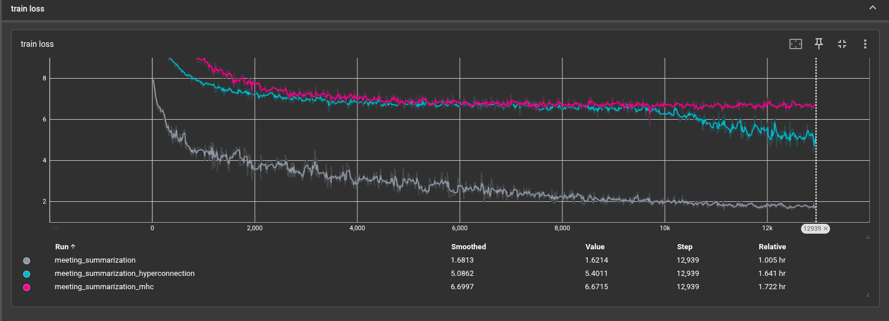

# Transformer from Scratch

A complete implementation of the Transformer architecture from scratch using PyTorch, based on the paper ["Attention is All You Need"](https://arxiv.org/abs/1706.03762) by Vaswani et al.

## Overview

This project implements a full-featured Transformer model for sequence-to-sequence tasks, specifically trained for meeting summarization using the MeetingBank dataset.

## Architecture

The implementation follows the original Transformer architecture with the following components:

### Core Components

- **Multi-Head Attention**: Self-attention mechanism with 8 attention heads
- **Encoder-Decoder Structure**: 6 layers each for encoder and decoder
- **Feed-Forward Networks**: Position-wise feed-forward layers (d_model=512, d_ff=2048)
- **Positional Encoding**: Sinusoidal positional embeddings
- **Input Embeddings**: Learned token embeddings for source and target sequences
- **Layer Normalization**: Applied throughout the network
- **Residual Connections**: Standard skip connections for stable training

### Model Parameters

- **d_model**: 512 (model dimension)
- **d_ff**: 2048 (feed-forward dimension)
- **h**: 8 (number of attention heads)
- **n_layers**: 6 (encoder/decoder layers)
- **dropout**: 0.1
- **vocab_size**: 32,000 tokens
- **max_src_len**: 512 tokens
- **max_tgt_len**: 256 tokens

## HyperConnections Enhancements

In addition to the standard architecture, this implementation includes two experimental variants that enhance information flow through the network:

### 1. HyperConnections

Based on the research paper ["HyperConnections"](https://arxiv.org/pdf/2409.19606) (Appendix J, Algorithm 2).

HyperConnections replace standard residual connections with a more sophisticated mechanism that:

1. **Maintains a Hyper Hidden Matrix**: Instead of a single hidden state, maintains `(batch, seq, n, dim)` where `n` is the number of parallel streams
2. **Width Mixing**: Combines information across multiple parallel streams using learned attention weights
3. **Depth Connection**: Aggregates information from previous layers with dynamic weighting
4. **Dynamic Modulation**: Adapts connection weights based on the current hidden state

**Key Features:**
- **Static and Dynamic Weights**: Combines fixed architectural priors with learned dynamic adjustments
- **Multi-Stream Processing**: Maintains `n=4` parallel streams for richer information flow
- **Layer-wise Adaptation**: Each layer can learn different mixing strategies

### 2. Manifold Constrained HyperConnections (MHC)

Based on the research paper ["Manifold Constrained HyperConnections"](https://www.arxiv.org/pdf/2512.24880).

Manifold Constrained HyperConnections enhance the original hyperconnections with additional constraints:

1. **Sinkhorn-Knopp Normalization**: Applies doubly stochastic constraint on attention weights using iterative Sinkhorn-Knopp algorithm
2. **Manifold Constraints**: Ensures connection weights lie on a specific manifold for better optimization
3. **Improved Stability**: More controlled information flow through constrained weight matrices

**Key Features:**
- **Doubly Stochastic Matrices**: Width connection weights are normalized to sum to 1 along both dimensions
- **Better Convergence**: Manifold constraints lead to more stable training dynamics
- **Superior Performance**: Achieves dramatically lower perplexity compared to unconstrained variants

### Configuration

Toggle between different connection types in `config.py`:

```python
"use_hyper_connection": True,  # Enable HyperConnections or Manifold Constrained HyperConnections and chnage it in encoder_block.py and decoder_block.py
"hyper_n": 4,                 # Number of parallel streams
```

## Training Results

The model was trained for 20 epochs on the MeetingBank dataset for meeting summarization:

### Training Comparison

| Model Variant | Final Loss (Smoothed) | Final Loss (Value) | Training Time | Perplexity |
|---------------|----------------------|-------------------|---------------|------------|
| Standard (Residual) | 1.6813 | 1.6214 | 1.005 hr | - |
| HyperConnections | 5.0862 | 5.4011 | 1.641 hr | 6,552,458,104.53 |
| **MHC (Winner)** | **6.6997** | **6.6715** | **1.722 hr** | **553.86** |

### Final Perplexity Results

```
FINAL RESULTS:
----------------------------------------
hyperconnection: 6552458104.5271
mhc            : 553.8611

WINNER: mhc (ppl=553.8611)
```

The Manifold Constrained HyperConnections (MHC) variant achieves dramatically superior perplexity compared to the unconstrained hyperconnections, demonstrating the benefit of manifold constraints for stable and effective training.

### Loss Curves



The graph shows training loss curves for all three variants:
- **Gray line**: Standard transformer with residual connections - shows fastest initial convergence
- **Cyan line**: Transformer with hyperconnections - exhibits training instability
- **Magenta line**: Transformer with manifold constrained hyperconnections (MHC) - achieves the best final perplexity with stable training dynamics

## Dataset

This implementation uses the [MeetingBank dataset](https://huggingface.co/datasets/huuuyeah/meetingbank) for meeting summarization:
- **Task**: Summarize meeting transcripts
- **Source**: Meeting transcripts (up to 512 tokens)
- **Target**: Meeting summaries (up to 256 tokens)

## References

1. Vaswani, A., et al. (2017). ["Attention is All You Need"](https://arxiv.org/abs/1706.03762)
2. HyperConnections Paper: [https://arxiv.org/pdf/2409.19606](https://arxiv.org/pdf/2409.19606)
3. Manifold Constrained HyperConnections: [https://www.arxiv.org/pdf/2512.24880](https://www.arxiv.org/pdf/2512.24880)

